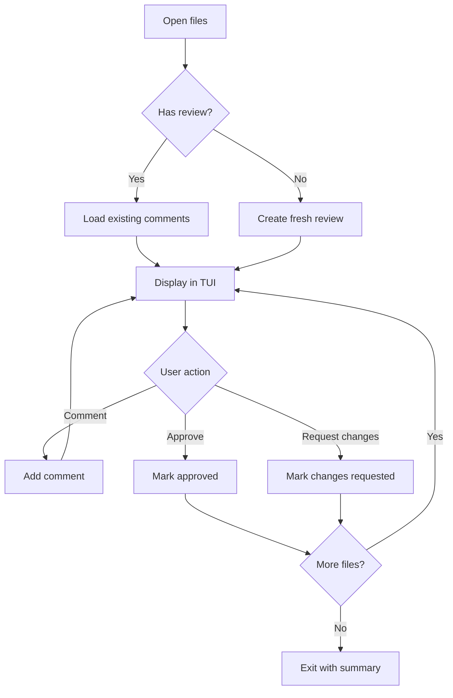
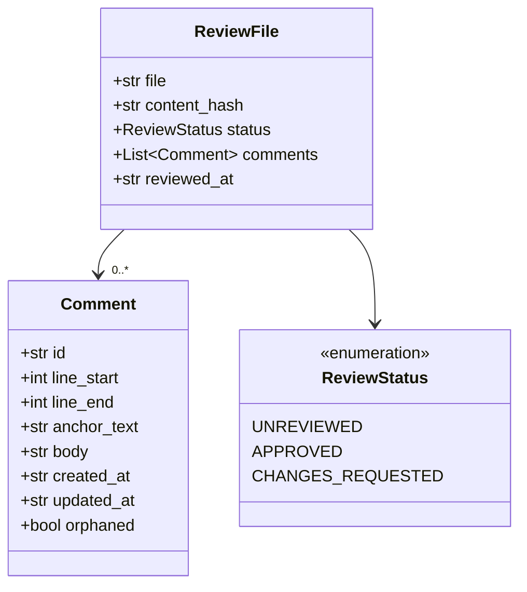
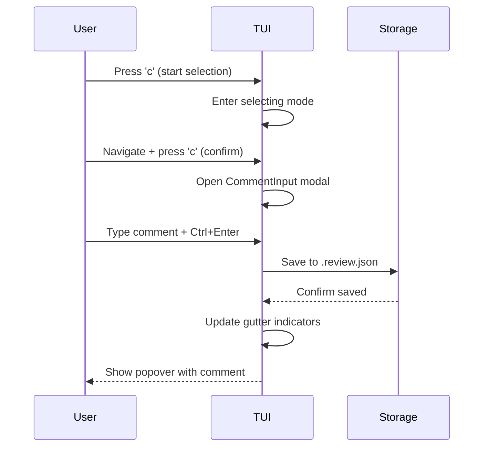

# Sample Document with Mermaid Diagrams

Some introductory text to test comment indicators against.

## Architecture Overview

Here's a flowchart showing the review process:

## Data Model

A class diagram of the core models:

## User Flow

A sequence diagram of adding a comment:

## Some Regular Content

This section has no diagrams — just text to navigate through and potentially comment on.

- Item one
- Item two
- Item three

### A Subsection

More text here to give the document some depth for testing navigation and commenting.
